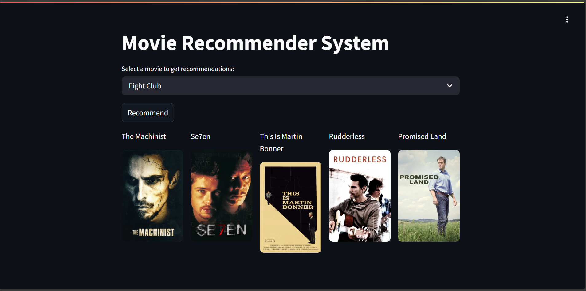

# Movie Recommender System 🎥

[](https://movie-recommender-system-rrut.streamlit.app/)


A content-based movie recommendation system that suggests films similar to a user's selection using machine learning and natural language processing techniques.

## Project Screenshot
  
*Movie recommendation for "Fight club"*

## Features ✨
- Recommends 5 similar movies based on genres, cast, crew, and plot
- Fetches movie posters using TMDB API
- Interactive Streamlit web interface
- Cosine similarity-based recommendation engine
- Git LFS support for large dataset files

## Live Demo 🔗
**[Try it here!](https://movie-recommender-system-rrut.streamlit.app/)**

## Installation 💻
1. Clone the repository:
   ```bash
   git clone https://github.com/rahul2022B0131055/movie-recommender-system.git
   cd movie-recommender-system

2. Install Git LFS (for large file support):
   ```bash
   git lfs install
   git lfs pull

3. Create virtual environment:
   ```bash
   python -m venv .venv
   source .venv/bin/activate  # Linux/Mac
   .\.venv\Scripts\activate  # Windows

4. Install dependencies:
   ```bash
   pip install -r requirements.txt

## Usage 🚀
- Start the Streamlit app:
    ```bash
    streamlit run app.py

1.Select a movie from the dropdown
2.Click "Recommend" to get similar movies

## Tech Stack 🛠️  
- **ML/NLP**: scikit-learn, nltk, TF-IDF Vectorization  
- **Backend**: Python, Pandas, Pickle  
- **Frontend**: Streamlit  
- **APIs**: TMDB Movie Database  
- **Deployment**: Streamlit Community Cloud  

## Dataset 📊  
**TMDB 5000 Movie Dataset**  
Contains:  
- 5000 movies metadata  
- Genre, keywords, cast, crew information  
- Movie ratings and popularity metrics  

## API Reference 🔌  
    ```
    def fetch_poster(movie_id):
    """Fetches movie poster URL from TMDB API"""
    response = requests.get(f'https://api.themoviedb.org/3/movie/{movie_id}?api_key=YOUR_API_KEY')
    data = response.json()
    return f"https://image.tmdb.org/t/p/w500{data['poster_path']}"


## Project Structure 📂  
movie-recommender-system/
├── app.py # Streamlit application
├── movies.pkl # Processed movie data
├── similarity.pkl # Precomputed similarity matrix
├── requirements.txt # Dependency list
└── README.md # Project documentation

# Future Improvements 🔮  
- Add user authentication  
- Implement collaborative filtering  
- Include movie trailers  
- Add rating predictions  
- Expand to TV show recommendations  

# Contact 📧  
- **rahul2022B0131055** - [GitHub Profile](https://github.com/rahul2022B0131055)  
- **Email** - rahulrai93107@gmail.com  
- **Project Link**: [Movie Recommender System](https://github.com/rahul2022B0131055/movie-recommender-system)  

